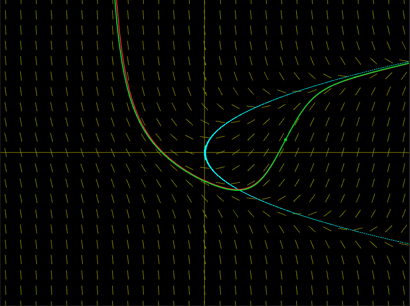
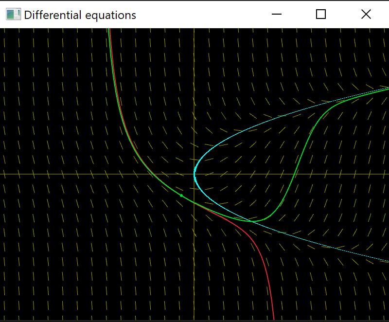

# About

A lightweight C++ visualizer built with Raylib that renders interactive slope fields and isoclines for first-order ordinary differential equations. It provides real-time numerical solutions using both Euler and fourth-order Runge-Kutta (RK4) methods, allowing users to compare accuracy and explore function behavior through a draggable coordinate system.

# Screenshots

Euler: red
Runge-Kutta: green

Euler and Runge-Kutta both quite accurate here

Euler is very inaccurate compared to Runge-Kutta
